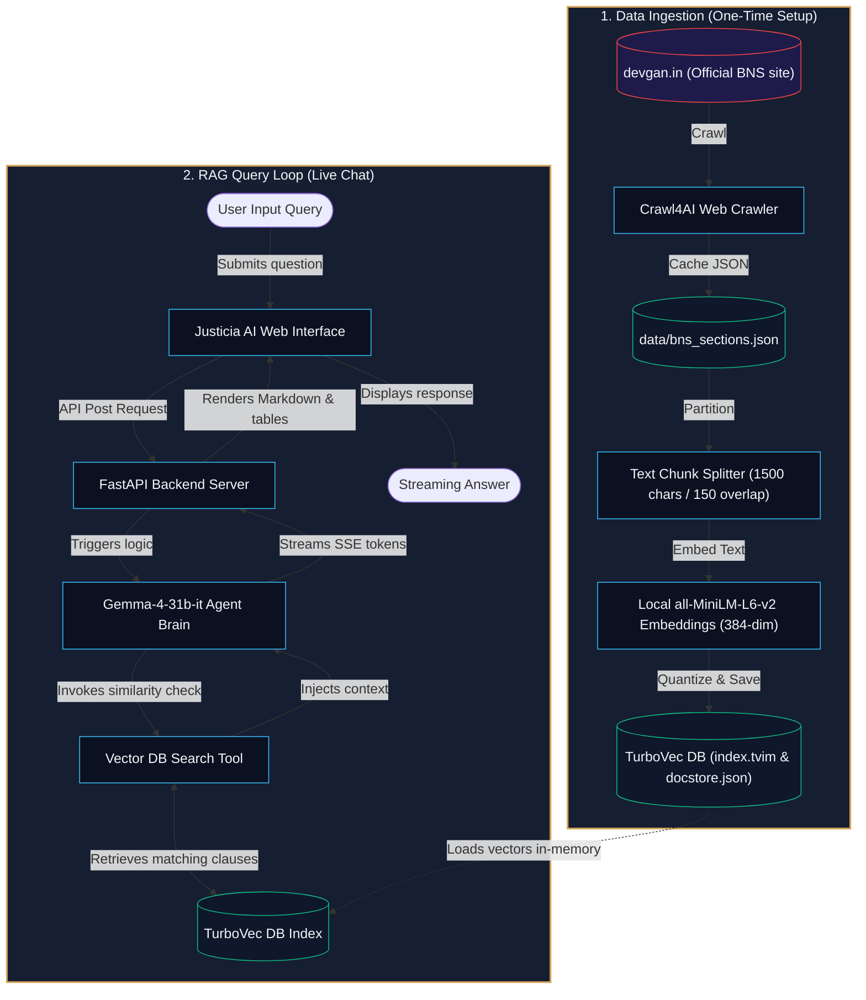

# Justicia AI - BNS Indian Law RAG System ⚖️

Justicia AI is a high-speed, local-first **Retrieval-Augmented Generation (RAG)** assistant specializing in the new **Bharatiya Nyaya Sanhita (BNS), 2023** (the penal code of India replacing the historical Indian Penal Code, IPC). 

The application utilizes **`gemma-4-31b-it`** for reasoning, **`sentence-transformers/all-MiniLM-L6-v2`** for local offline embeddings, a 4-bit quantized **[TurboVec](https://github.com/RyanCodrai/turbovec.git)** (which utilizes Google's **TurboQuant** algorithm) database for ultra-fast local semantic retrieval, and a simple web dashboard for interactive exploration.

---

## 🏗️ Architecture & Flow



* **One-Time Ingestion:** BNS sections are scraped, parsed, split into context-rich chunks (with parent chapter and section headers prepended), embedded locally, and quantized into a 4-bit local database.
* **Agentic RAG Query:** User queries are processed by a LangChain agent. The agent dynamically decides to run semantic vector lookups to find relevant sections, retrieves the exact law provisions offline, and passes the context to Gemma to synthesize a clean, proof-verified response containing external citation links.

---

## 📥 Data Collection & Scraping via Crawl4AI

The BNS law provisions are collected directly from the web using **[Crawl4AI](https://github.com/unclecode/crawl4ai)**, a high-performance web crawling framework.

* **Target URL:** BNS provisions were crawled sequentially from `https://devgan.in/bns/section/{section_id}/` for all 358 sections.
* **Performance Optimizations:** 
  * Implemented in [`scraper.py`](file:///c:/Users/rtnan/Desktop/Indian-Law-RAG/backend/scraper.py) using `AsyncWebCrawler` inside an async event loop for concurrent page scraping.
  * Used `CrawlerRunConfig` with `CacheMode.BYPASS` to fetch fresh page contents, avoiding cached pages.
* **Robust Fail-Safe Fallbacks:** 
  * If the crawler hits web blocks or Playwright driver exceptions, the script automatically triggers a fallback request layer using standard synchronous `requests` + `BeautifulSoup4` with custom User-Agent headers to ensure zero-loss collection.
* **Raw Storage:** The crawled raw laws (including Section numbers, titles, chapter names, content bodies, and source URLs) are stored in [`data/bns_sections.json`](file:///c:/Users/rtnan/Desktop/Indian-Law-RAG/data/bns_sections.json).

---

## 🛠️ Tech Stack

* **LLM (Reasoning Engine):** `gemma-4-31b-it` (Google Generative AI API)
* **Embedding Model:** `sentence-transformers/all-MiniLM-L6-v2` (Local, 384-dimensional)
* **Vector Store Database:** [TurboVec](https://github.com/RyanCodrai/turbovec.git) (utilizing Google **TurboQuant** for high-efficiency 4-bit vector quantization)
* **Backend Framework:** FastAPI, Uvicorn, LangChain, and LangChain-Classic
* **Crawler Engine:** Crawl4AI (with BeautifulSoup4 / requests fallback)
* **Web Client Frontend:** HTML5, Vanilla CSS3, JavaScript (Marked.js for markdown/table formatting, Lucide Icons)

---

## 📁 Repository Directory Structure

```
Indian-Law-RAG/
├── backend/
│   ├── main.py          # FastAPI application, CORS configs, and background task handlers
│   ├── scraper.py       # Crawl4AI/Requests crawler for retrieving BNS sections 1 to 358
│   ├── ingest.py        # Sentence Splitting, local HuggingFace embedding, & TurboVec indexer
│   └── rag_agent.py     # LangChain Agent Executor configuration and output normalizer
├── data/
│   └── bns_sections.json # Raw crawled text cached from devgan.in
├── db/
│   ├── index.tvim       # TurboVec serialized 4-bit vector search index
│   └── docstore.json    # Local document content mapping and metadata store
├── frontend/
│   ├── index.html       # Web dashboard container, Lucide icons, & Marked.js imports
│   ├── style.css        # Simple styling, custom scrollbars, & table formatting
│   └── app.js           # Client chat engine, server polling, and Markdown renderer
├── .env                 # Environment variables (GEMINI_API_KEY)
├── run.py               # Main launcher helper script
└── requirements.txt     # Python dependency definitions
```

---

## 🚀 Getting Started (Developer Setup)

### 1. Prerequisites
Ensure you have **Python 3.10+** installed on your machine.

### 2. Environment Setup
Clone this repository and create a Python virtual environment:
```bash
# Navigate to directory
cd Indian-Law-RAG

# Create virtual environment
python -m venv .venv

# Activate virtual environment
# On Windows:
.venv\Scripts\activate
# On Linux/macOS:
source .venv/bin/activate
```

### 3. Installation
Install dependencies using `uv` (recommended for speed) or standard `pip`:
```bash
# Using standard pip
pip install -r requirements.txt
```

### 4. API Key Configuration
Create a `.env` file in the root folder and add your Google Gemini API Key:
```env
GEMINI_API_KEY=your_gemini_api_key_here
```

---

## 🏃 Running the Application

### 1. Ingest Data (If starting from scratch)
*Note: This project already includes a fully populated raw cache in `data/bns_sections.json` and a built database in `db/`.*

If you need to rebuild the database, run:
```bash
# Run vector store indexer
python backend/ingest.py
```
This will download the `all-MiniLM-L6-v2` model, chunk the sections, run local embeddings, and write the vector index files to the `db/` directory.

### 2. Launch the Application Server
Run the convenience startup script:
```bash
python run.py
```
This starts the FastAPI backend server on **`http://127.0.0.1:8000`** and serves the static frontend interface.

---

## 📡 REST API Documentation

### 1. `GET /api/status`
Checks the overall state of the server.
* **Response:**
  ```json
  {
    "is_scraping": false,
    "scraped_count": 358,
    "scraped_total": 358,
    "is_ingesting": false,
    "db_loaded": true,
    "api_key_configured": true
  }
  ```

### 2. `POST /api/query`
Sends a question to the legal agent brain.
* **Request:**
  ```json
  {
    "query": "What is the punishment for murder in the new BNS?",
    "chat_history": []
  }
  ```
* **Response:**
  ```json
  {
    "answer": "Section 302 of the IPC... has been replaced by Section 103 BNS...",
    "steps": [
      {
        "tool": "search_bns_laws",
        "tool_input": { "query": "punishment for murder" },
        "log": "Agent reasoning text...",
        "observation_length": 4306
      }
    ]
  }
  ```

### 3. `POST /api/trigger-scrape`
Starts a background scraper worker to collect law data.

### 4. `POST /api/trigger-ingest`
Triggers vector store indexing as a background task.

---

## 💡 Developer Customizations

* **Vary Chunking Parameters:** Edit `backend/ingest.py` to change `chunk_size` and `chunk_overlap` in the `RecursiveCharacterTextSplitter`.
* **Switch Embedding Model:** Change the `model_name` parameter in `HuggingFaceEmbeddings` within `backend/ingest.py` and `backend/rag_agent.py` to use other HuggingFace/Sentence-Transformers models (ensure vector dimensions are a multiple of 8 to work with TurboVec).
* **Adjust LLM Temperature:** Modify `temperature` inside the `ChatGoogleGenerativeAI` constructor in `backend/rag_agent.py`.
